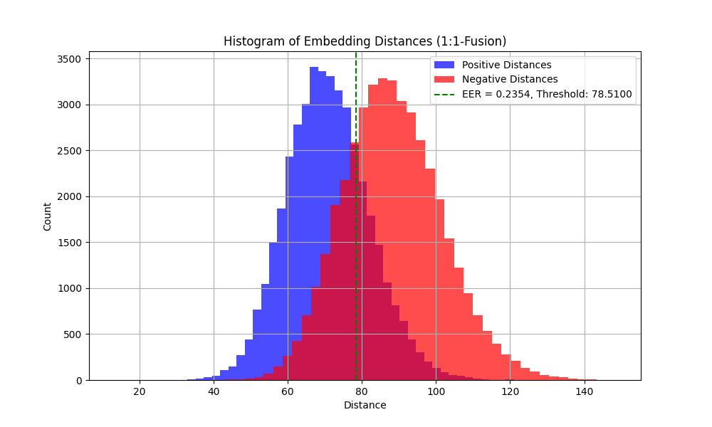
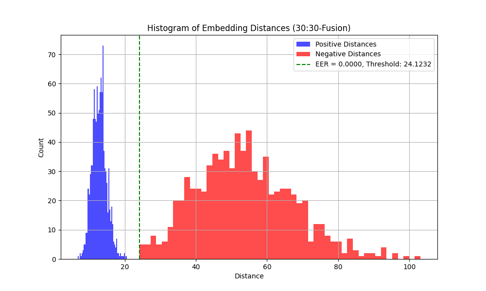

# AimNet Mouse Dynamics
The first open sourced approach to **One-Shot Learning for Mouse Dynamics** recognition, using a Siamese Neural Network. This repository includes data preprocessing, model training, and evaluation for identifying distinct individuals via their mouse movement patterns. The models were trained and tested on a dataset collected from over 2000 players in Minecraft to achieve satisfactory results described in the evaluation section below. 

One-Shot Learning is highly advantageous for biometric recognition systems. It allows new users to enroll with just one data sample, eliminating the need for model re-training. The model generates a unique, compact embedding of mouse movement patterns from this single sample. These embeddings are distinct and can be efficiently compared to others using simple mathematical operations (i.e., Euclidean distance).


## Dataset Overview

The models were trained and tested on the `Aim Dataset for Minecraft`, which contains the mouse movements of **2219** distinct individuals playing a competitive fighting game where precise mouse aiming is important. For that reason, this dataset is classified as **app-restricted continuous**: Players were free to move their mouse as they liked, and only the movements sent in the Minecraft game are captured. The dataset contains the following columns:
- `uuid`: A unique identifier for each individual, anonymized for privacy.
- `delta_yaw`: The vertical movement delta of the mouse.
- `delta_pitch`: The horizontal movement delta of the mouse.
- Several other columns, including the absolute timestamp, absolute yaw/pitch, and the absolute positions of both the player and their opponent (target). The 3 columns above are the only ones I use at present, though others may enhance performance if properly applied.

## Model Overview

The primary model I use is an LSTM Classifier visualized below that takes in a sequence of `SEQ_LENGTH` mouse movements containing both `delta_yaw` and `delta_pitch`. It is largely based on the [TypeNet](https://arxiv.org/pdf/2101.05570) architecture, with an additional linear layer at the end (Note: Transposition operations are necessary between some layers to ensure LSTM compatibility). 
<table>
  <thead>
    <tr>
      <th>Layer Type</th>
      <th>Input Shape</th>
      <th>Output Shape</th>
    </tr>
  </thead>
  <tbody>
    <tr>
      <td>BatchNorm1d</td>
      <td>(batch_size, 2, 100)</td>
      <td>(batch_size, 2, 100)</td>
    </tr>
    <tr>
      <td>LSTM</td>
      <td>(batch_size, 100, 2)</td>
      <td>(batch_size, 100, 128)</td>
    </tr>
    <tr>
      <td>Dropout</td>
      <td>(batch_size, 100, 128)</td>
      <td>(batch_size, 100, 128)</td>
    </tr>
    <tr>
      <td>BatchNorm1d</td>
      <td>(batch_size, 100, 128)</td>
      <td>(batch_size, 100, 128)</td>
    </tr>
    <tr>
      <td>LSTM</td>
      <td>(batch_size, 100, 128)</td>
      <td>(batch_size, 100, 128)</td>
    </tr>
    <tr>
      <td>Linear</td>
      <td>(batch_size, 128)</td>
      <td>(batch_size, 1000)</td>
    </tr>
  </tbody>
</table>
Once the classifier is trained, it is used as the base for an embedding model, designed to produce distinct embeddings comparable via Euclidean distance. This is optimized by triplet loss, a contrastive loss method that rewards small distances between samples from the same user, and large distances between samples from different users. The embedding model is a simple linear layer of size `EMBEDDING_SIZE` appended to the end of the classification model. Its generic form allows for any classifier to be used.

<table>
  <thead>
    <tr>
      <th>Layer Type</th>
      <th>Input Shape</th>
      <th>Output Shape</th>
    </tr>
  </thead>
  <tbody>
    <tr>
      <td>Pre-Trained Base Classifier</td>
      <td>(batch_size, 2, 100)</td>
      <td>(batch_size, 1000)</td>
    </tr>
    <tr>
      <td>Linear (Embedding Layer)</td>
      <td>(batch_size, 1000)</td>
      <td>(batch_size, 128)</td>
    </tr>
  </tbody>
</table>

## Performance Results
The evaluation script will produce a histogram of distances between positive samples (embeddings from the same user) and negative samples (embeddings from different users). The desired result is that these two sets of distances form separable peaks with little to no overlap between them.The images below show examples of histograms generated using a single embedding (Figure 1) and 30 embeddings (Figure 2), producing Equal Error Rates of 23% and 0%, respectively. For continuous authentication, these results have very practical applications in account security, and possibly 1:N user identification.

<table style="border-collapse: collapse; width: 100%;">
  <tr>
    <td style="text-align: center; border: none;">
      
    </td>
    <td style="text-align: center; border: none;">
      
    </td>
  </tr>
  <tr>
    <td style="text-align: center; border: none;">
      <i>Figure 1: Distances between individuals using a single embedding produces an EER of 23.54%.</i>
    </td>
    <td style="text-align: center; border: none;">
      <i>Figure 2: Distances between individuals using 30 combined embeddings produces an EER of 0.00%.</i>
    </td>
  </tr>
</table>

These results were achieved on a held-out test set of the remaining 1219 users that were not part of training.


## Configuration

Edit the `AimNet.py` file to configure the following parameters:
- `SEQ_LENGTH = 100`: Sequence length for each input sequence.
- `CLASSIFIER_EPOCHS = 100`: Number of epochs for training the classification model.
- `EMBEDDING_EPOCHS = 100`: Number of epochs for training the embedding model.
- `BATCH_SIZE = 256`: Batch size for training.
- `LEARNING_RATE = 0.001`: Learning rate for optimization.
- `EMBEDDING_SIZE = 128`: Size of the embedding vector.
- `NUM_CLASSES = 1000`: Number of users for classification.
- `VALID_SPLIT = 0.2`: Ratio of training data to use for validation.
- `FUSE_GALLERY = 30` and `FUSE_TEST = 30`: Number of embeddings to fuse for evaluation.
- `DATA_INPUT_PATH = 'aim_data.csv'`: Path to the input data file.
- `CLASSIFIER_OUT_PATH = './models/aimnet_classifier.pth'`: Path to save the trained classifier model.
- `EMBEDDER_OUT_PATH = './models/aimnet_embedding_model.pth'`: Path to save the trained embedding model.
- `EMBEDDINGS_PATH = './embeddings/generated_embeddings.npy'`: Path to save the generated embeddings.
- `EMBEDDINGS_LABELS_PATH = './embeddings/generates_labels.npy'`: Path to save the labels for the generated embeddings.
- `READ_COLUMNS = ['uuid', 'delta_yaw', 'delta_pitch']`: Columns to read from the input CSV file.
- `LABEL_COLUMN = 'uuid'`: Column to use as labels.
- `FEATURE_COLUMNS = ['delta_yaw', 'delta_pitch]`: Columns to use as features.
- `DISTANCE_FUNCTION = 'euclidean'`: Distance function for evaluation (`'euclidean'`, `'cosine'`, or `'fused'`).

## File Structure

- `AimNet.py`: The main script to execute the pipeline, including preprocessing, training, and evaluation.
- `Preprocessing.py`: Contains functions for creating user sequences and splitting data.
- `ClassificationUtils.py`: Contains utilities for training the classification model and creating data loaders.
- `TripletUtils.py`: Contains utilities for training the embedding model and creating triplet loaders.
- `EvaluationUtils.py`: Contains functions for evaluating the embedding model and generating embeddings.

## Usage

1. **Train the classification model**:

    In AimNet.py, adjust the configuration to `MODE: 'train_classifier_model'` and `DO_PREPROCESSING: True`, then run the script.
    ```bash
    python AimNet.py
    ```
    The model will automatically train with the specified parameters, and (when done) produce a plot of accuracy over time. 

2. **Train the embedding model**:
   
    In AimNet.py, adjust the configuration to `MODE: 'train_embedding_model'` and `DO_PREPROCESSING: True`, then run the script.
    ```bash
    python AimNet.py
    ```
    If desired, you may adjust `FREEZE_BASE` as `True` or `False`, noting that disabling this option will take longer to train, but may produce better results.

4. **Evaluate Embedding Model**:
   
    In AimNet.py, adjust the configuration to `MODE: 'evaluate_embedding_model'` and `DO_PREPROCESSING: True`, then run the script.
    ```bash
    python AimNet.py
    ```
    After running this the first time, it will generate the embeddings and write them to `EMBEDDINGS_PATH` and `EMBEDDINGS_LABEL_PATH`. Once these exist for a given model, you should set `DO_PREPROCESSING = False` to load embeddings directly from those files without processing them again.

## Installation

1. **Clone the Repository**:
    ```bash
    git clone https://github.com/templateprotection/AimNet-Mouse-Dynamics.git
    cd AimNet-Mouse-Dynamics
    ```

2. **Install Dependencies**:
    Ensure you have Python 3.7 or later. Install the required packages using pip:
    ```bash
    pip install -r requirements.txt
    ```

    The `requirements.txt` should include:
    ```
    numpy
    pandas
    torch
    scikit-learn
    matplotlib
    tqdm
    ```

## Contributing

Contributions are welcome - Please submit a pull request or open an issue if you have suggestions or improvements.

## License

This project is licensed under the MIT License. See the [LICENSE](LICENSE) file for details.

## Contact

For any questions or feedback, please contact [templateprotection] at ~~[temporarily_private@example.com]~~, or join the Discord at ~~[temporarily_private.com]~~

